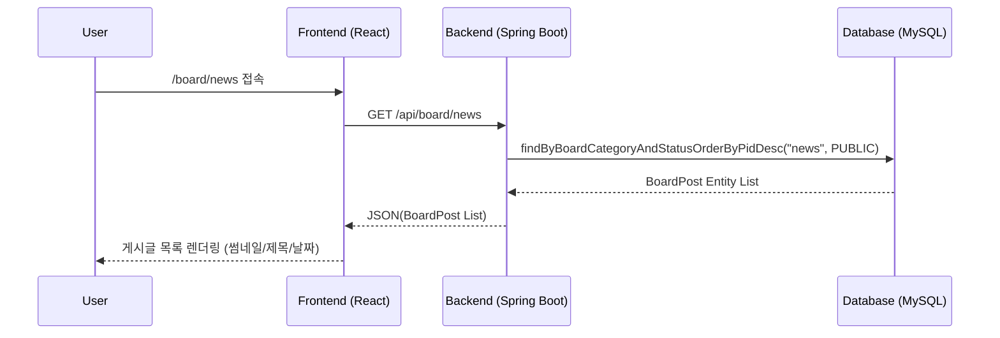
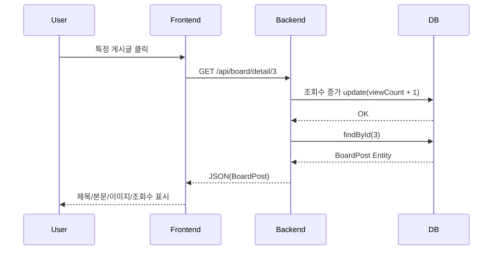

1. 게시판 목록 조회 (GET /api/board/{category})

2. 게시글 상세 조회 (GET /api/board/detail/{pid})

3. 게시글 작성 (POST /api/board/write)
```mermaid
sequenceDiagram
    participant User
    participant Frontend
    participant Backend
    participant DB

    User->>Frontend: 글 작성 입력 + 이미지 업로드
    Frontend->>Backend: POST /api/upload
    Backend->>DB: 파일 저장 (uploads)
    DB-->>Backend: 저장 완료
    Backend-->>Frontend: 이미지 URL 반환

    User->>Frontend: 작성 버튼 클릭
    Frontend->>Backend: POST /api/board/write
    Note right of Frontend:
        요청 body 예시:
        - title, content
        - uid, writer
        - categoryTag
        - imageUrl, thumbnailUrl
        헤더: XSRF-TOKEN + 세션 쿠키 포함

    Backend->>DB: save(BoardPost)
    DB-->>Backend: 저장 완료

    Backend-->>Frontend: 저장된 게시글 JSON 반환
    Frontend-->>User: 해당 카테고리 목록으로 이동

```
4. 게시글 수정 (PUT /api/board/update/{pid})
```mermaid
sequenceDiagram
    participant User
    participant Frontend
    participant Backend
    participant DB

    User->>Frontend: 수정 버튼 클릭
    Frontend->>Frontend: 기존 게시글 데이터 form에 채움

    User->>Frontend: 수정 내용 입력 후 제출
    Frontend->>Backend: PUT /api/board/update/3
    Note right of Frontend:
        body: 수정된 title, content, imageUrl 등
        인증: 세션 쿠키 + XSRF-TOKEN

    Backend->>Backend: 권한 체크 (관리자 또는 작성자)
    Backend->>DB: findById(3)
    DB-->>Backend: 기존 BoardPost

    Backend->>DB: 수정된 내용 저장
    DB-->>Backend: 저장 완료

    Backend-->>Frontend: 수정된 게시글 JSON
    Frontend-->>User: 상세 페이지로 이동
```
5. 게시글 삭제 (DELETE /api/board/delete/{pid})
```mermaid
sequenceDiagram
    participant User
    participant Frontend
    participant Backend
    participant DB

    User->>Frontend: 삭제 버튼 클릭
    Frontend->>Backend: DELETE /api/board/delete/3
    Note right of Frontend:
        요청 헤더:
        - withCredentials true
        - XSRF-TOKEN 포함

    Backend->>Backend: 권한 체크
    Backend->>DB: findById(3)
    DB-->>Backend: BoardPost 읽기

    Backend->>DB: deleteById(3)
    DB-->>Backend: 삭제 완료

    Backend-->>Frontend: 삭제 성공 메시지
    Frontend-->>User: 게시판 목록으로 이동
```