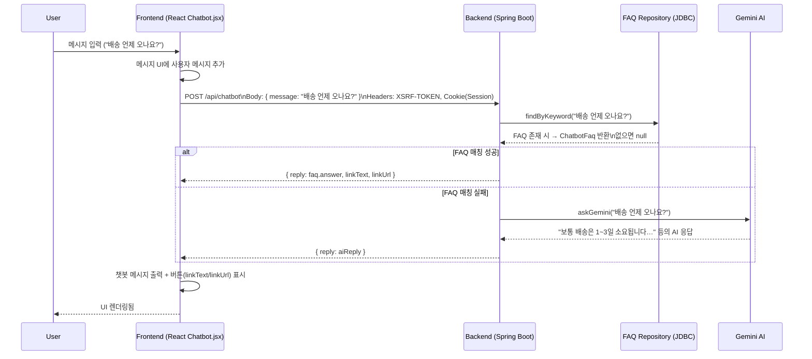
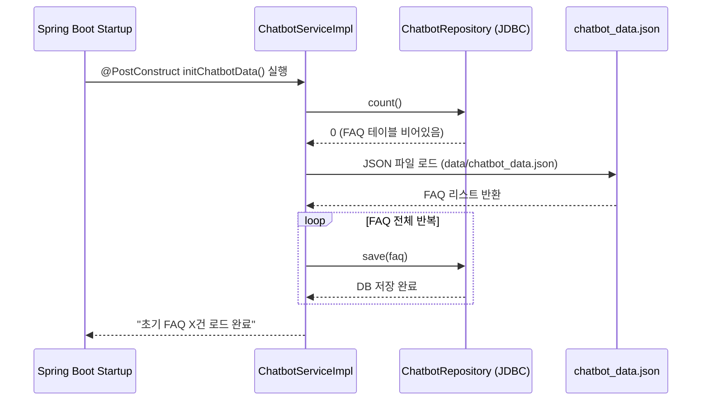
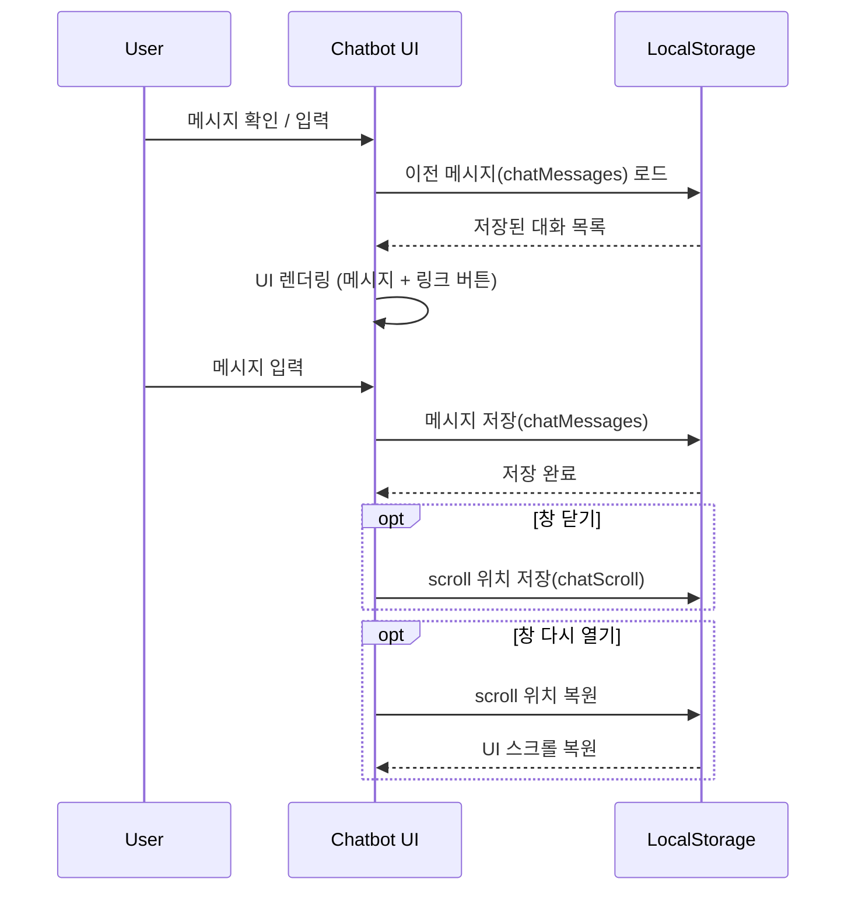
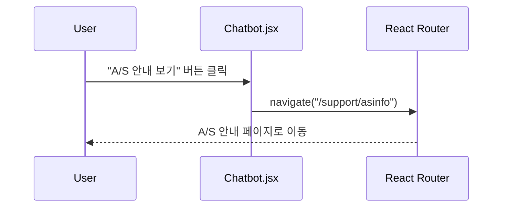

1. 챗봇 메시지 전송 및 응답 Sequence

```mermaid
sequenceDiagram
    participant User
    participant Frontend as Frontend (React Chatbot.jsx)
    participant Backend as Backend (Spring Boot)
    participant Repo as FAQ Repository (JDBC)
    participant AI as Gemini AI

    %% 1. 사용자 입력
    User->>Frontend: 메시지 입력 ("배송 언제 오나요?")
    Frontend->>Frontend: 메시지 UI에 사용자 메시지 추가

    %% 2. 백엔드로 POST 요청
    Frontend->>Backend: POST /api/chatbot\nBody: { message: "배송 언제 오나요?" }\nHeaders: XSRF-TOKEN, Cookie(Session)

    %% 3. FAQ DB 검색
    Backend->>Repo: findByKeyword("배송 언제 오나요?")
    Repo-->>Backend: FAQ 존재 시 → ChatbotFaq 반환\n없으면 null

    alt FAQ 매칭 성공
        Backend-->>Frontend: { reply: faq.answer, linkText, linkUrl }
    else FAQ 매칭 실패
        %% AI 백업 응답
        Backend->>AI: askGemini("배송 언제 오나요?")
        AI-->>Backend: "보통 배송은 1~3일 소요됩니다…" 등의 AI 응답
        Backend-->>Frontend: { reply: aiReply }
    end

    %% 4. 프론트에서 메시지 출력
    Frontend->>Frontend: 챗봇 메시지 출력 + 버튼(linkText/linkUrl) 표시
    Frontend-->>User: UI 렌더링됨
```
2. Chatbot FAQ 초기 데이터 로딩 (서버 시작 시 자동)

```mermaid
sequenceDiagram
    participant Spring as Spring Boot Startup
    participant Service as ChatbotServiceImpl
    participant Repo as ChatbotRepository (JDBC)
    participant File as chatbot_data.json

    Spring->>Service: @PostConstruct initChatbotData() 실행
    
    Service->>Repo: count()
    Repo-->>Service: 0  (FAQ 테이블 비어있음)

    Service->>File: JSON 파일 로드 (data/chatbot_data.json)
    File-->>Service: FAQ 리스트 반환

    loop FAQ 전체 반복
        Service->>Repo: save(faq)
        Repo-->>Service: DB 저장 완료
    end

    Service-->>Spring: "초기 FAQ X건 로드 완료"
```
3. 챗봇 UI — 메시지 저장 및 불러오기 Sequence

```mermaid
sequenceDiagram
    participant User
    participant Frontend as Chatbot UI
    participant Local as LocalStorage

    User->>Frontend: 메시지 확인 / 입력

    Frontend->>Local: 이전 메시지(chatMessages) 로드
    Local-->>Frontend: 저장된 대화 목록

    Frontend->>Frontend: UI 렌더링 (메시지 + 링크 버튼)

    User->>Frontend: 메시지 입력
    Frontend->>Local: 메시지 저장(chatMessages)
    Local-->>Frontend: 저장 완료

    opt 창 닫기
        Frontend->>Local: scroll 위치 저장(chatScroll)
    end

    opt 창 다시 열기
        Frontend->>Local: scroll 위치 복원
        Local-->>Frontend: UI 스크롤 복원
    end
```
4. 챗봇 링크 버튼 클릭 → 특정 페이지 이동

```mermaid
sequenceDiagram
    participant User
    participant Frontend as Chatbot.jsx
    participant Router as React Router

    User->>Frontend: "A/S 안내 보기" 버튼 클릭
    Frontend->>Router: navigate("/support/asinfo")
    Router-->>User: A/S 안내 페이지로 이동
```